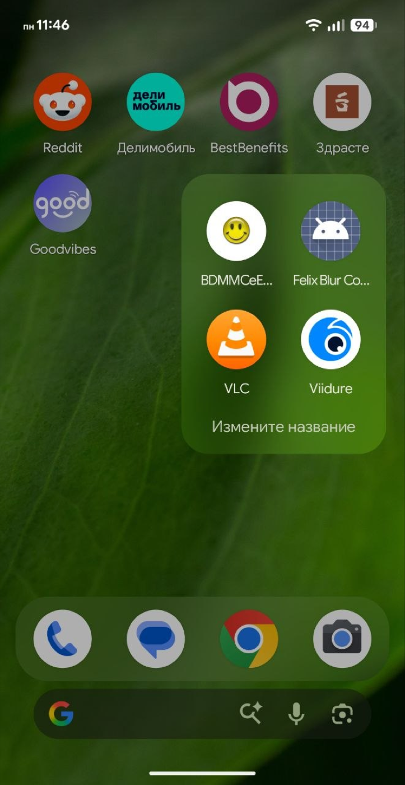
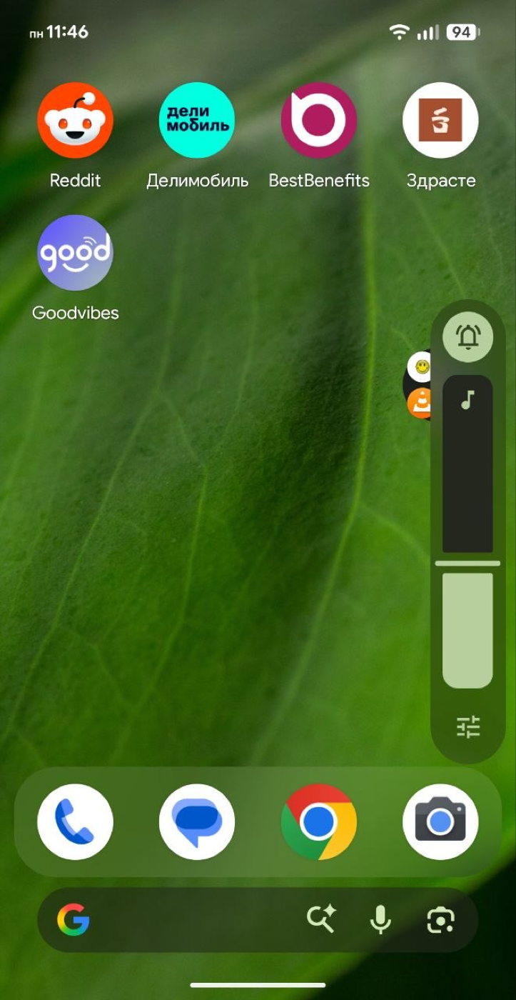
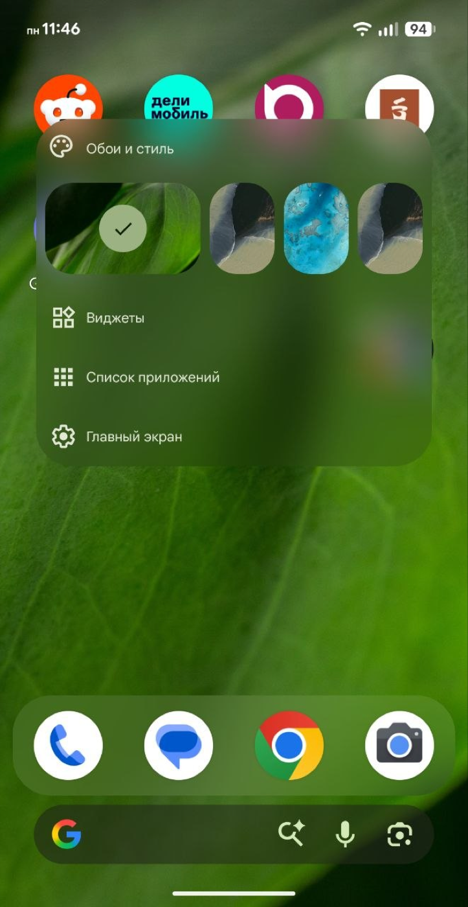
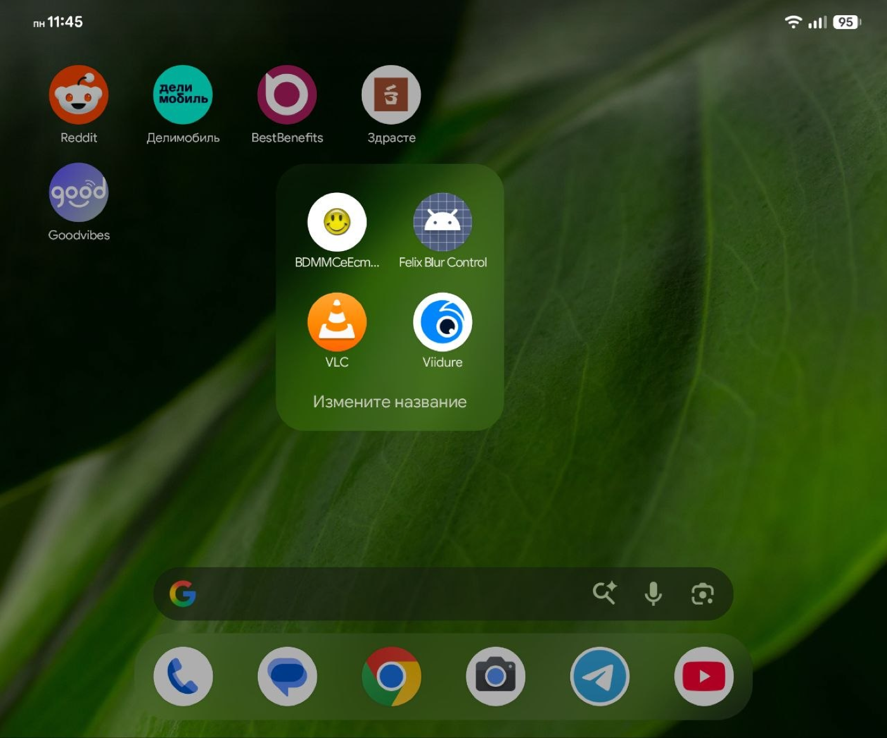
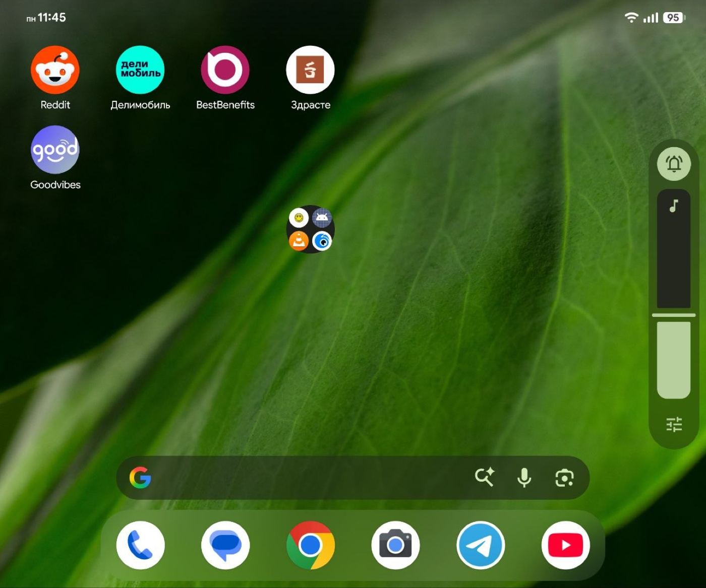
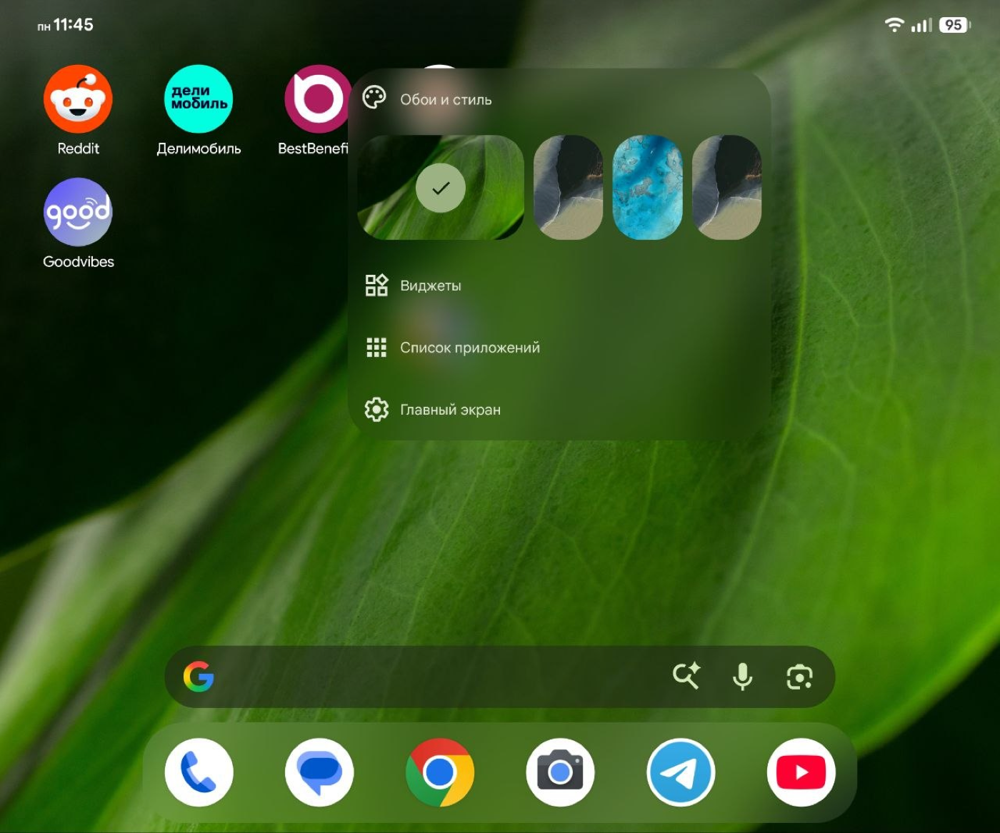
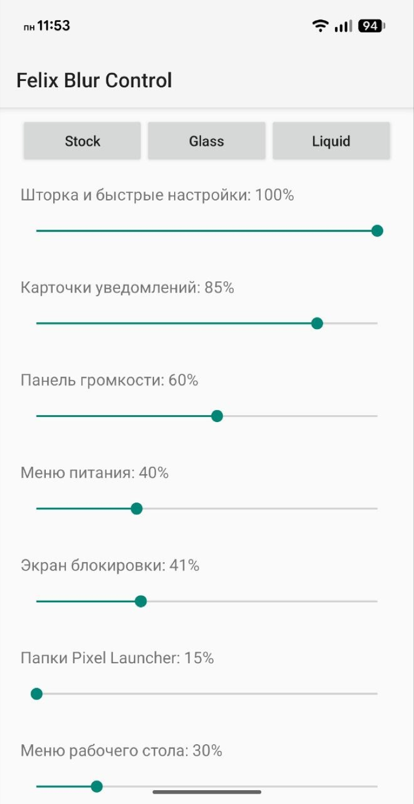

<div align="center">

# Felix Blur Control

**Bring back Android's hidden background blur and tune it to your taste.**

An LSPosed module for Google Pixel devices that unlocks disabled blur paths in
SystemUI and Pixel Launcher, then gives you simple controls for a cleaner,
lighter, glass-like appearance.


</div>

> [!IMPORTANT]
> Felix Blur Control is built for Google's Pixel SystemUI and Pixel Launcher.
> It has been developed and tested on the first-generation Pixel Fold (`felix`,
> Tensor G2) running Android 17 QPR2 Beta. Internal Google classes can change
> between updates, so other builds and devices may require adaptation.

## Preview

The module keeps the wallpaper visible behind launcher surfaces while retaining
enough blur and tint for icons and text to remain readable.

<table>
  <tr>
    <td align="center"></td>
    <td align="center"></td>
    <td align="center"></td>
  </tr>
  <tr>
    <td align="center"><b>Launcher folders</b></td>
    <td align="center"><b>Volume panel and dock</b></td>
    <td align="center"><b>Workspace menu</b></td>
  </tr>
</table>

<details>
<summary><b>See the unfolded Pixel Fold layout</b></summary>
<br>
<table>
  <tr>
    <td></td>
    <td></td>
    <td></td>
  </tr>
  <tr>
    <td align="center"><b>Folder</b></td>
    <td align="center"><b>Home and volume</b></td>
    <td align="center"><b>Workspace menu</b></td>
  </tr>
</table>
</details>

## What It Does

Felix Blur Control enables blur checks that Google may disable through device
configuration, then adjusts the opaque color layers drawn above the blurred
content. Lower opacity exposes more of the wallpaper or app underneath; blur
strength remains independently adjustable.

- Enables the framework blur expansion and app-launch blur paths.
- Reports background blur and high-end graphics support inside target processes.
- Enables Pixel Launcher's workspace blur implementation.
- Enables supported SystemUI blur paths, including the volume and power panels.
- Adjusts the notification shade, notification cards and lockscreen scrims.
- Adjusts Pixel Launcher folders and the long-press workspace menu.
- Provides **Stock**, **Glass** and **Liquid** presets for quick setup.
- Exposes individual sliders when you want to fine-tune every surface.

## Controls

<table>
  <tr>
    <td width="42%"></td>
    <td valign="top">
      <br>
      <b>Transparency</b><br><br>
      Notification shade and Quick Settings<br>
      Notification cards<br>
      Volume panel<br>
      Power menu<br>
      Lockscreen<br>
      Pixel Launcher folders<br>
      Pixel Launcher workspace menu<br>
      Pixel Dock Glass integration<br><br>
      <b>Blur</b><br><br>
      Global blur strength for supported surfaces
    </td>
  </tr>
</table>

Changes normally appear the next time a surface is opened. If a running process
keeps an old value cached, restart Pixel Launcher/SystemUI or reboot the device.

> [!NOTE]
> The **Pixel Dock Glass** slider is an integration point for a compatible Pixel
> Dock Glass module. It does not create the custom dock by itself.

## Requirements

- A rooted Google Pixel device with working Zygisk injection.
- LSPosed API 93 or newer.
- Android 12 or newer (`API 31+`).
- Google Pixel Launcher for launcher effects.
- A compositor/device build that actually supports cross-window background blur.

The module can bypass software and resource gates inside SystemUI and Launcher,
but it cannot add missing GPU/compositor support to unsupported hardware.

## Installation

1. Download and install `Felix-Blur-Control-v8.apk`.
2. Open LSPosed and enable **Felix Blur Control**.
3. Select both recommended scopes:
   - `com.android.systemui`
   - `com.google.android.apps.nexuslauncher`
4. Reboot the phone.
5. Open the **Felix Blur Control** app and choose a preset or tune the sliders.

No fabricated RRO overlays or manual property changes are required on the tested
Pixel Fold setup. Existing system-wide blur support must still be functional.

## Presets

| Preset | Appearance |
| --- | --- |
| **Stock** | Restores the original color-layer opacity and blur strength. |
| **Glass** | A balanced translucent look with comfortable readability. |
| **Liquid** | The clearest, most expressive preset, with stronger blur and lighter overlays. |

Every preset is only a starting point. All values remain editable afterward.

## Troubleshooting

### The module is active, but nothing changed

- Confirm that both packages are selected in the LSPosed scope.
- Reboot after enabling or updating the module.
- Check the LSPosed log for entries beginning with `FelixBlur:`.
- Make sure Android's global **Disable window-level blurs** option is off.
- Verify that your ROM and compositor support cross-window background blur.

### Launcher works, but SystemUI does not

Check that `com.android.systemui` is enabled in the module scope. SystemUI hooks
are firmware-sensitive and may need an update after a new Android QPR or beta.

### A slider seems to have no effect

Some controls only affect a surface once that surface is recreated. Close and
reopen it first; if necessary, restart its process or reboot. The dock control
also requires a compatible Pixel Dock Glass module.

### The UI becomes too transparent

Select **Glass** or **Stock**, then raise the relevant opacity slider. Extremely
low opacity can reduce contrast on bright wallpapers.

## Compatibility

| Component | Status |
| --- | --- |
| Pixel Fold (`felix`, Tensor G2) | Tested |
| Android 17 QPR2 Beta | Tested target |
| Pixel SystemUI | Required for SystemUI hooks |
| Pixel Launcher | Required for launcher hooks |
| Other Pixel models/builds | Experimental |
| AOSP or third-party launchers | Not supported by launcher hooks |

Major Android and Pixel Launcher updates may rename or replace private classes.
Always disable the module before installing a major system update if you want the
easiest recovery path, then enable it again after confirming compatibility.

## How It Works

The module hooks only the two selected processes. At runtime it:

1. Overrides framework resource and property checks used to gate blur.
2. Enables the relevant Launcher and SystemUI blur code paths.
3. Scales the alpha channel of panel colors, notification tints and scrims.
4. Supplies user-selected values through the module's settings provider.

It does not replace framework APKs or permanently edit the system partition.
Disabling the module and rebooting returns the hooked processes to their original
behavior.

## Source Layout

```text
src/
├── AndroidManifest.xml
├── META-INF/xposed/scope.list
├── assets/xposed_init
└── dev/codex/felixblur/
    ├── BlurSettingsActivity.java
    ├── BlurSettingsProvider.java
    └── FelixBlurHook.java
```

The project is intentionally small and uses Java with the classic Xposed entry
point. The bundled APK is version `8.0` (`versionCode 8`) with package name
`dev.codex.felixblur`.

## Building

This source snapshot is a minimal Android project without a Gradle wrapper. A
manual build requires:

- JDK
- Android SDK 36
- Xposed API stubs
- `javac`, `d8`, `aapt2`, `zipalign` and `apksigner`

Compile the Java sources, convert the output to `classes.dex`, package it with
the manifest, Xposed metadata and assets, then align and sign the APK. Updates
must be signed with the same key as the installed build. The private signing key
is intentionally not included.

## Safety

Felix Blur Control changes visual behavior inside privileged system processes.
Keep a known-good way to disable LSPosed modules, and test new Android builds
carefully. You use the module at your own risk.

---

<div align="center">

Made for people who like the Pixel experience, just with a little more glass.

</div>
